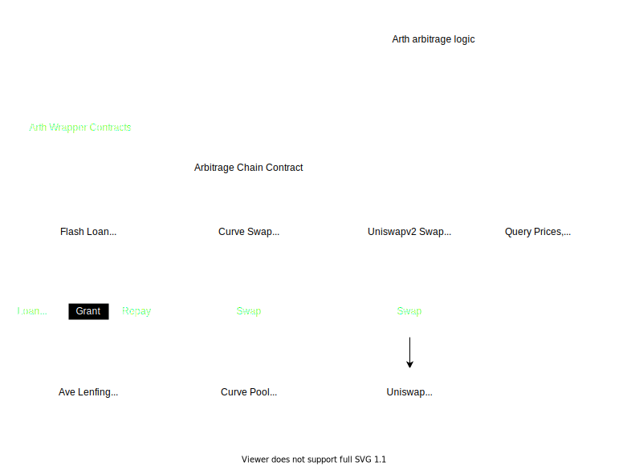

# Flash Loan Arbitrage

## Objectives
* Low gas fee burnt on revert
* Add new DEXs and Flash loan lenders easily

It consists of primitive contracts and pipeline contracts. An example arbitrage contract that uses Aave flashloan lending contract and UniswapV2, Curve-fi dexes is shown below. 

## Primitive Contracts
### ArthCurveSwap
Smart contract wrapper for peforming asset swap on Curve pool.
### ArthUniswapv2Swap
Smart contract wrapper for peforming asset swap on UniswapV2 pair.
## Arbitrage Chain Contracts
These contracts gule two or more swap contracts to perform the arbitrage.
### ArthArbitrageA1CU2
Implements logic for obtaining flash loan from Ave and performing asset swaps on Curve and UniswapV2.
It provides interface for specifying asset type, Curve pool and UniswapV2 pair to be used for swapping.

## DeFi Protocols
DeFi protocols being used.
### Curve-fi
https://curve.fi/rootfaq  
https://resources.curve.fi/  
Curve is an exchange liquidity pool on Ethereum designed for stablecoin trading. Curve allows users (and smart contracts) to trade between DAI and USDC.

Fees and pool parameters are decided by the Curve DAO.
Currently, the fee on all pools seems to be 0.04%, of which 50% goemay go to liquidity providers, and 50% to veCRV holders (members of the DAO.

Curve has developed a pool factory, a way for anyone to deploy a Curve Metapool with the 3Pool or sBTC Pool.  
The meta pool can specify it's own fee that ranges from 0.04% to 1% and needs to meet certain criteria such as minimum merket cap of $3M/$10M? to be listed in the Curve main UI 
https://resources.curve.fi/faq/pool-factory#pool-factory-curve-listing-requirements

## UniswapV2
https://uniswap.org/docs/v2/protocol-overview/how-uniswap-works/  
https://uniswap.org/docs/v2/smart-contracts/router02/  
Uniswap is an automated liquidity protocol powered by a constant product formula and implemented in a system of non-upgradeable smart contracts on the Ethereum blockchain. It obviates the need for trusted intermediaries, prioritizing decentralization, censorship resistance, and security. Uniswap is open-source software licensed under the GPL.

Pairs act as automated market makers, standing ready to accept one token for the other as long as the “constant product” formula is preserved.
